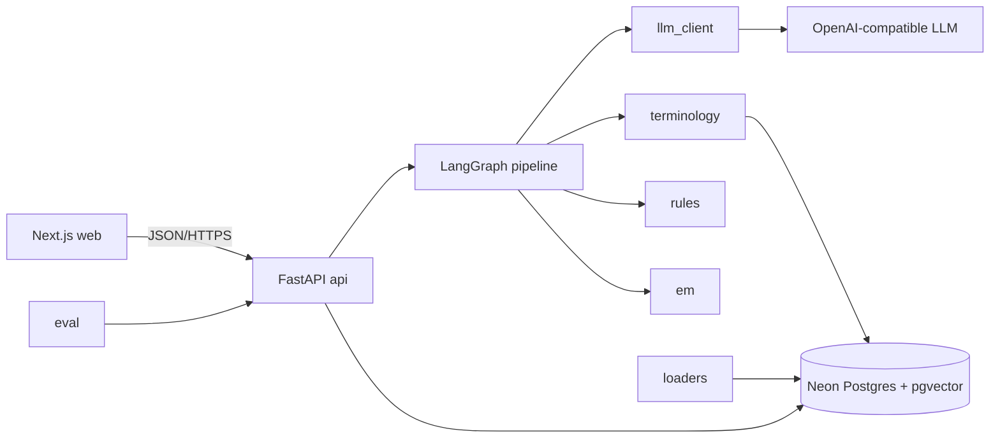
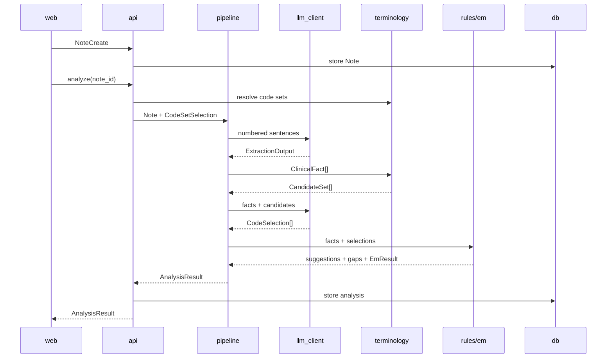

# CodeCare AI — Design

This file is the source of truth for coding agents working in this repository. Update it in the same change as any component, type, endpoint, rule, or scope change.

## 1. Overview

CodeCare AI is a web application for medical coders reviewing synthetic outpatient clinical notes. It extracts clinical facts with sentence-level evidence, retrieves valid ICD-10-CM and limited CPT candidates, checks deterministic coding rules, and flags missing documentation. The coder accepts, edits, or rejects every suggestion. The core principle is: **the LLM reads the note; code validates the result; the human decides.**

The MVP covers type 2 diabetes, chronic kidney disease (CKD), hypertension, heart failure, office-visit E/M codes, and a small lab CPT subset.

## 2. Goals and Non-Goals

### Goals

- Extract diagnoses, procedures, medication facts, and MDM elements with sentence evidence.
- Suggest only codes found in the code set valid on the visit date.
- Apply the MVP rules in Section 3.4 as deterministic Python functions.
- Highlight supporting sentences and show documentation gaps.
- Record append-only coder decisions.
- Compare the full pipeline with an LLM-only baseline on 50 synthetic notes.
- Keep invented-code rate at zero.

### Non-Goals

- Real patient data, PHI, or production clinical use.
- Claim submission or billing-system integration.
- Inpatient coding, ICD-10-PCS, DRGs, or payer-specific policies.
- Full CPT content, official AMA descriptions, or modifiers beyond NCCI checks.
- E/M calculation by time; the MVP uses MDM only.
- Live analysis while a clinician types.
- Authentication, multiple users, or multiple tenants.
- Model training, fine-tuning, or autonomous coding approval.

## 3. Architecture

### 3.1 Components

| Component | Owns | Does not own |
|---|---|---|
| `web` | Note form, review screen, evidence highlights, review actions | Coding logic |
| `api` | HTTP contracts, validation, persistence, pipeline invocation | Clinical interpretation |
| `pipeline` | Linear LangGraph analysis flow and failure routing | Database writes or UI |
| `llm_client` | OpenAI-compatible calls, JSON validation, timeout, one retry | Code validity or rule decisions |
| `terminology` | Code-set selection, abbreviation/index lookup, candidate retrieval | Final code selection |
| `rules` | Deterministic rules R1–R14 | LLM calls |
| `em` | MDM 2-of-3 E/M calculation | Extracting MDM from text |
| `db` | Code data, notes, analyses, reviews | Business logic |
| `loaders` | Importing ICD-10-CM, NCCI, abbreviations, and CPT subset | Runtime analysis |
| `eval` | Gold-set runs, metrics, and baseline comparison | User traffic |
| LLM provider | Structured model inference | Storage, code search, or validation |

### 3.2 Component diagram



### 3.3 Technology choices

| Area | Choice | Reason |
|---|---|---|
| Frontend | Next.js 15, TypeScript, Tailwind | Simple two-panel web UI; Vercel free tier |
| Backend | Python 3.12, FastAPI, Pydantic v2 | Typed contracts and strong AI/data tooling |
| Pipeline | LangGraph, linear graph only | Named stages and failure tracing; no agents or checkpointer |
| Database | Neon Postgres 16, pgvector, `pg_trgm` | Relational data and search in one free service |
| ORM | SQLAlchemy 2, Alembic | Typed persistence and migrations |
| Search | FTS + trigram + `BAAI/bge-small-en-v1.5` embeddings (run with `fastembed`/ONNX, no torch) | Handles abbreviations and semantic matches without another service |
| LLM | OpenAI-compatible API configured by environment | Provider-independent; Groq first, Hugging Face backup |
| Backend hosting | Hugging Face Space using Docker | Free deployment target |
| Local development | Docker Compose | Reproducible frontend, backend, and Postgres setup |
| CI | GitHub Actions | Tests and evaluation on each change |

Required LLM variables: `LLM_BASE_URL`, `LLM_API_KEY`, and `LLM_MODEL`. Use temperature `0` and JSON mode. Select the final free model in M2 using 10 gold notes.

### 3.4 MVP coding rules

| Rule | Behavior |
|---|---|
| R1 | Reject codes absent, inactive, non-billable, or invalid for the visit date. |
| R2 | Diabetes with CKD: evaluate E11.22 and require the documented N18 stage code. |
| R3 | Hypertension with CKD: evaluate I12.x plus N18.x instead of isolated I10. |
| R4 | Hypertension with heart failure: evaluate I11.0 plus I50.x. |
| R5 | Hypertension, heart failure, and CKD: evaluate I13.x plus I50.x and N18.x. |
| R6 | Remove duplicate I10 when a supported I11/I12/I13 combination applies. |
| R7 | Missing diabetes type: default only when guidelines allow and mark for review. |
| R8 | Add supported long-term medication status codes for documented insulin/oral therapy. |
| R9 | Missing CKD stage or stage 3 subtype: keep the supported less-specific code and raise a neutral gap. |
| R10 | Missing heart-failure type or acuity: use supported specificity and raise a gap. |
| R11 | Outpatient probable/suspected/rule-out diagnoses are not coded as confirmed. |
| R12 | Apply Excludes1/tabular conflicts; allow review only where the official exception can apply. |
| R13 | Flag CPT without a supporting diagnosis; apply effective NCCI PTP pairs and modifier indicator. |
| R14 | Compute E/M from extracted MDM; return no E/M code when required elements are missing. |

## 4. Data Flow

### 4.1 Analyze a note

1. `web` sends `NoteCreate` to `POST /api/v1/notes`.
2. `api` segments the text into numbered `Sentence` objects and stores `Note`.
3. `web` calls `POST /api/v1/notes/{note_id}/analyze`.
4. `terminology` selects FY2026 or FY2027 from `Note.visit_date`.
5. `llm_client` converts the numbered sentences into `ExtractionOutput`; it must not output codes.
6. `terminology` returns up to 20 real, billable `CodeCandidate` values per active/performed fact. The fact text (concept plus details) is abbreviation-expanded, then searched three ways: trigram match on Alphabetic Index term paths (a category hit such as `N18.3-` expands to its billable descendants), full-text search on descriptions, and vector search on description embeddings. Results merge by reciprocal rank fusion (k=60). `sources` lists every search that found the code, plus `abbreviation` when the fact text was expanded.
7. `llm_client` returns `CodeSelection` values chosen only from those candidates.
8. `rules` validates and transforms suggestions, adds `RuleResult` values, and emits `Gap` values.
9. `em` computes `EmResult` from `MdmElements` using deterministic MDM logic.
10. `pipeline` assembles `AnalysisResult`; `api` stores it and returns it to `web`.
11. `web` shows note evidence beside suggestions. The coder remains the final decision-maker.

### 4.2 Review a suggestion

1. `web` sends `ReviewRequest` to `POST /api/v1/analyses/{analysis_id}/suggestions/{suggestion_id}/reviews`.
2. `api` validates edited codes through `terminology`.
3. `api` appends a `ReviewEvent`; reviews are never updated or deleted.
4. A changed note is stored as a new `Note`, so old approvals never carry forward.

### 4.3 Main sequence



### 4.4 Failure behavior

| Failure | Behavior |
|---|---|
| LLM timeout, 429, or HTTP error | Wait up to `Retry-After` capped at 20 seconds; retry once; then return `LLM_UNAVAILABLE`. |
| Invalid model JSON | Retry once with the validation error; then return `LLM_BAD_OUTPUT`. |
| Invalid sentence evidence | Drop the fact and increment `model_errors`. |
| Selected code outside candidates | Drop the selection and increment `model_errors`. |
| Code set missing for visit date | Return `409 CODE_SET_MISSING`; do not run the pipeline. |
| Rule or pipeline failure | Return no partial suggestions; store a failed analysis. |
| Database write failure | Return `500 DB_ERROR`; do not return an unstored result. |
| Entire analysis exceeds 150 seconds | Cancel and return `503 TIMEOUT`. |

## 5. Types and Data Models

Backend models live in `backend/app/models/`. Frontend types are generated from FastAPI OpenAPI; never hand-edit them.

### 5.1 Core and API types

```python
from datetime import date, datetime
from typing import Literal
from pydantic import BaseModel, Field

CodeSystem = Literal["ICD-10-CM", "CPT"]
PatientType = Literal["new", "established"]
FactKind = Literal["condition", "procedure", "medication"]
FactStatus = Literal["active", "history", "ruled_out", "denied", "suspected", "performed", "planned"]
Confidence = Literal["strong", "review", "not_suggested"]
ReviewAction = Literal["accept", "edit", "reject"]
MdmLevel = Literal["straightforward", "low", "moderate", "high"]

class Sentence(BaseModel):
    n: int                    # 1-based number within the note
    section: str              # normalized note section
    text: str                 # exact sentence text
    start: int                # inclusive offset in Note.text
    end: int                  # exclusive offset in Note.text

class NoteCreate(BaseModel):
    visit_date: date          # selects the effective code release
    patient_type: PatientType # selects new/established E/M range
    text: str = Field(min_length=20, max_length=20_000)
    parent_note_id: str | None = None # prior version, if revised

class Note(BaseModel):
    id: str
    visit_date: date
    patient_type: PatientType
    text: str
    sentences: list[Sentence]
    parent_note_id: str | None
    created_at: datetime

class FactLink(BaseModel):
    type: Literal["caused_by", "associated_with"]
    target_fact_id: str

class ClinicalFact(BaseModel):
    fact_id: str
    kind: FactKind
    concept: str              # normalized clinical term
    status: FactStatus
    details: dict[str, str]   # stage, type, acuity, laterality, drug, etc.
    links: list[FactLink]
    evidence: list[int]       # supporting Sentence.n values

class MdmElements(BaseModel):
    problems: MdmLevel | None
    data: MdmLevel | None
    risk: MdmLevel | None
    evidence: list[int]

class ExtractionOutput(BaseModel):
    facts: list[ClinicalFact]
    mdm: MdmElements

class CodeCandidate(BaseModel):
    code: str
    system: CodeSystem
    description: str         # official ICD text or project-written CPT label
    score: float
    sources: list[Literal["abbreviation", "index", "text", "vector"]]

class CandidateSet(BaseModel):
    fact_id: str
    candidates: list[CodeCandidate] # maximum 20

class CodeSelection(BaseModel):
    fact_id: str
    code: str | None          # must belong to this fact's CandidateSet
    evidence: list[int]
    rationale: str = Field(max_length=300)

class RuleResult(BaseModel):
    rule_id: str              # R1 through R14
    outcome: Literal["pass", "fail", "needs_review"]
    message: str
    source_ref: str           # guideline/table source identifier
    affects_codes: list[str]

class Gap(BaseModel):
    gap_id: str
    kind: Literal["missing", "ambiguous", "conflicting", "unsupported"]
    missing: str
    affects_codes: list[str]
    rule_id: str | None
    query_text: str           # neutral; must not lead toward higher payment
    severity: Literal["blocking", "review", "info"]

class EmResult(BaseModel):
    code: str | None
    mdm_level: MdmLevel | None
    missing: list[str]

class Suggestion(BaseModel):
    suggestion_id: str
    code: str
    system: CodeSystem
    description: str
    fact_ids: list[str]
    evidence: list[int]
    rule_results: list[RuleResult]
    gap_ids: list[str]
    confidence: Confidence

class CodeSetSelection(BaseModel):
    icd10cm: str              # e.g. ICD10CM-FY2027
    cpt: str                  # e.g. CPT-DEMO-2026

class PipelineError(BaseModel):
    code: Literal["LLM_UNAVAILABLE", "LLM_BAD_OUTPUT", "TIMEOUT", "CODE_SET_MISSING", "DB_ERROR"]
    stage: str
    message: str

class AnalysisResult(BaseModel):
    analysis_id: str
    note_id: str
    status: Literal["completed", "failed"]
    code_sets: CodeSetSelection
    facts: list[ClinicalFact]
    suggestions: list[Suggestion]
    gaps: list[Gap]
    em: EmResult | None
    model: str
    prompt_version: str
    model_errors: int
    latency_ms: int
    error: PipelineError | None
    created_at: datetime

class ReviewRequest(BaseModel):
    action: ReviewAction
    replacement_code: str | None = None # required for edit
    reason: str | None = None           # required for reject

class ReviewEvent(BaseModel):
    id: str
    analysis_id: str
    suggestion_id: str
    action: ReviewAction
    replacement_code: str | None
    reason: str | None
    created_at: datetime

class ErrorResponse(BaseModel):
    error_code: str
    message: str
    analysis_id: str | None = None

class HealthResponse(BaseModel):
    service: Literal["codecare-api"]
    db: bool
    code_sets: list[str]      # loaded CodeSet ids, e.g. ICD10CM-FY2027
```

### 5.2 LLM and internal tool contracts

```python
# LLM call 1: list[Sentence] + PatientType -> ExtractionOutput
# LLM call 2: list[ClinicalFact] + list[CandidateSet] -> list[CodeSelection]
# Both calls use JSON mode, temperature 0, schema validation, and one retry.

def resolve_code_sets(session: Session, visit_date: date) -> CodeSetSelection: ...  # raises CodeSetMissingError
def search_candidates(session: Session, fact: ClinicalFact, code_sets: CodeSetSelection, embedder: Embedder) -> CandidateSet: ...

class CodeLookup(Protocol):  # the only way rules read code tables; tests use an in-memory version
    def get_code(self, code: str, code_set_id: str) -> CodeCandidate | None: ...
    def children_of(self, code: str, code_set_id: str) -> list[str]: ...
    def is_billable(self, code: str, code_set_id: str) -> bool: ...

def ncci_conflict(code_a: str, code_b: str, visit_date: date) -> RuleResult | None: ...
def run_rules(note: Note, facts: list[ClinicalFact], selections: list[CodeSelection]) -> tuple[list[Suggestion], list[Gap]]: ...
def compute_em(mdm: MdmElements, patient_type: PatientType) -> EmResult: ...
```

The note is untrusted data. Prompts must instruct the model to ignore instructions inside the note and use only supplied sentence numbers and candidates.

### 5.3 Database tables

| Table | Important fields | Keys/indexes |
|---|---|---|
| `code_sets` | `id`, `system`, `valid_from`, `valid_to`, `source_url` | PK `id`; index on validity dates |
| `codes` | `code_set_id`, `code`, `description`, `billable`, `parent_code`, `tabular_notes`, `embedding`, `tsv` | PK `(code_set_id, code)`; GIN `tsv`; HNSW `embedding`; index `parent_code` |
| `index_terms` | `code_set_id`, `term`, `path`, `code` | trigram index `term`; index `(code_set_id, code)` |
| `abbreviations` | `abbr`, `expansion` | PK `abbr` |
| `ncci_ptp` | `column1_code`, `column2_code`, `valid_from`, `valid_to`, `modifier_allowed` | PK `(column1_code, column2_code, valid_from)` |
| `notes` | `id`, `visit_date`, `patient_type`, `text`, `sentences`, `parent_note_id`, `created_at` | PK `id`; FK `parent_note_id` |
| `analyses` | `id`, `note_id`, `status`, `result_json`, `model`, `prompt_version`, `created_at` | PK `id`; index `(note_id, created_at)` |
| `reviews` | `id`, `analysis_id`, `suggestion_id`, `action`, `replacement_code`, `reason`, `created_at` | PK `id`; index `(analysis_id, suggestion_id)`; append-only |

`codes` is loaded from the CMS order file (codes, billable flag, long description) and tabular XML. `parent_code` is the longest proper prefix that is itself a code. `tabular_notes` holds the notes declared directly on that code, with keys `excludes1`, `excludes2`, `use_additional`, `code_first`, `code_also`, `inclusion`; inherited notes are found by walking `parent_code`. `index_terms` has one row per Alphabetic Index path and code (`term` is the path as one phrase without nonessential modifiers, used for trigram search; `path` keeps them for display; a trailing `-` is dropped; CMS "Note: ..." pseudo-headings are skipped because they are guidance, not terms).

`reviews` append-only is enforced in the database: a trigger rejects `UPDATE`, `DELETE`, and `TRUNCATE`.

CPT data contains only the project-approved subset and project-written labels. Do not import official AMA descriptions without a license.

## 6. API Contracts

Base path: `/api/v1`. All request and response bodies are JSON.

| Method | Path | Input | Output | Errors |
|---|---|---|---|---|
| `GET` | `/health` | none | `HealthResponse` | `500 DB_ERROR` |
| `POST` | `/notes` | `NoteCreate` | `201 Note` | `422 VALIDATION_ERROR`, `404 PARENT_NOTE_NOT_FOUND` |
| `GET` | `/notes/{note_id}` | path ID | `Note` | `404 NOTE_NOT_FOUND` |
| `POST` | `/notes/{note_id}/analyze` | path ID | `200 AnalysisResult` | `404`, `409 CODE_SET_MISSING`, `503` LLM/timeout, `500 DB_ERROR` |
| `GET` | `/analyses/{analysis_id}` | path ID | `AnalysisResult` | `404 ANALYSIS_NOT_FOUND` |
| `POST` | `/analyses/{analysis_id}/suggestions/{suggestion_id}/reviews` | `ReviewRequest` | `201 ReviewEvent` | `404`, `422 INVALID_REPLACEMENT_CODE` |
| `GET` | `/notes/{note_id}/history` | path ID | note, analyses, and reviews | `404 NOTE_NOT_FOUND` |

CORS permits only `http://localhost:3000` and the configured Vercel origin.

## 7. Folder Structure

```text
CodeCareAI/
├── DESIGN.md                  # source of truth
├── README.md                  # setup, demo, limitations, results
├── docker-compose.yml         # local web, API, and Postgres
├── backend/
│   ├── app/
│   │   ├── api/               # FastAPI routes
│   │   ├── models/            # Pydantic contracts from Section 5
│   │   ├── db/                # SQLAlchemy models and repositories
│   │   ├── segment/           # section and sentence numbering
│   │   ├── pipeline/          # LangGraph state, graph, and nodes
│   │   ├── llm/               # provider-neutral client and prompts
│   │   ├── loaders/           # CMS/NCCI/CPT parsers used by scripts/
│   │   ├── terminology/       # code-set selection, retrieval, embeddings, CodeLookup
│   │   ├── rules/             # R1–R14, one module per rule
│   │   └── em/                # deterministic MDM calculator
│   ├── alembic/               # migrations
│   └── tests/                 # unit and integration tests
├── frontend/
│   ├── app/                   # note entry and review pages
│   ├── components/            # note, suggestion, gap, and review UI
│   └── lib/                   # generated API types and client
├── data/
│   ├── raw/                   # downloaded files; gitignored
│   ├── cpt_subset.csv         # approved demo codes and custom labels
│   ├── abbreviations.csv      # DM2, CKD, HFrEF, etc.
│   └── gold_notes/            # 50 synthetic labeled notes
├── scripts/                   # ICD, NCCI, CPT, and abbreviation loaders
├── eval/                      # baseline, runner, metrics, reports
└── .github/workflows/         # CI, full eval, deployment
```

## 8. Key Decisions

| Choice | Rejected | Reason |
|---|---|---|
| LLM selects only retrieved candidates | Free code generation | Prevents invented codes |
| Deterministic rules | LLM-only policy reasoning | Testable and repeatable |
| Linear LangGraph | Agent network or queue | Traceable without unnecessary orchestration |
| Postgres search + pgvector | Separate search/vector services | One database and lower cost |
| Analyze button | Live typing analysis | Much simpler MVP |
| Immutable notes and reviews | In-place edits | Preserves evidence and approvals |
| Synchronous analysis | Redis/job queue | One-user demo does not need a queue |
| FY2026 and FY2027 by visit date | Latest release only | Correct date-of-service behavior and a visible demo |
| Provider-neutral LLM configuration | Hard-coded vendor | Free-provider flexibility |
| ICD end-to-end before CPT | Building both pipelines simultaneously | Faster working slice; both remain in v1 |

Complexity rule: do not add authentication, queues, FHIR, caching, microservices, or additional conditions unless this document is deliberately updated.

## 9. Testing and Evaluation

### Component testing

- `segment`: section detection, numbering, and exact offsets.
- `terminology`: date-based releases, abbreviations, search ranking, and billable filtering.
- `rules`: positive, negative, and edge case for every R1–R14 rule.
- `em`: all supported MDM combinations and missing-element behavior.
- `llm_client`: timeouts, 429, invalid JSON, schema failure, and retry limit.
- `pipeline`: complete success and failure flows using recorded model responses.
- `api`: every endpoint and documented error.
- `web`: Playwright flow for analyze, highlight, accept, edit, and reject.

### AI evaluation

Use 50 synthetic `GoldNote` cases and the same model for both the full pipeline and LLM-only baseline.

| Metric | Required threshold |
|---|---|
| Invented-code rate | `0` — hard gate |
| Unsupported-code rate | `≤ 5%` |
| Code precision | `≥ 0.85` |
| Code recall | `≥ 0.80` |
| Expected-gap recall | `≥ 0.80` |
| E/M exact match | `≥ 0.75` |
| Evidence accuracy | `≥ 0.90` on a manually checked sample |

The owner will validate expected results against FY2027 guidelines and code tables. The README must state that the set has **not** been reviewed by a certified coder. If available later, a certified coder reviews a 10–15 note sample.

## 10. Build Order

| Milestone | Testable result |
|---|---|
| M0 | Repo, Docker Compose, FastAPI health endpoint, Postgres, migrations, and CI work. |
| M1 | Load FY2027 ICD codes, tabular notes, Alphabetic Index, abbreviations, and embeddings; candidate-search tests pass. |
| M2 | Thin slice: create note → extract facts → retrieve/select ICD candidates → R1 → return evidence-backed results. Compare Groq and Hugging Face models on 10 notes and select one. |
| M3 | Add 20 gold notes, evaluation runner, and LLM-only baseline. |
| M4 | Add ICD rules R2–R12, gaps, confidence, and rule tests. |
| M5 | Load FY2026 and demonstrate code-set selection across September 30/October 1, 2026. |
| M6 | Add CPT subset, NCCI, MDM extraction, E/M calculation, and R13–R14. |
| M7 | Add append-only review and history APIs. |
| M8 | Build and test the two-panel Next.js review UI. |
| M9 | Expand to 50 notes, meet or document evaluation thresholds, deploy to Vercel/Hugging Face/Neon, and publish limitations in README. |

## 11. Open Questions

1. Which Groq and Hugging Face models perform best in the M2 comparison?
2. Is the public-demo use of the CPT subset and hand-built MDM logic acceptable without additional licensing review? If uncertain, keep CPT labels project-written and clearly mark the feature as educational.
3. Can a certified coder review 10–15 gold notes later?
4. Are free Hugging Face Space cold starts acceptable for the final demo?
5. CMS also published an April 1, 2026 ICD-10-CM update inside FY2026. Should M5 load it as a separate code set (2026-04-01 to 2026-09-30)?
6. `CodeSetSelection.cpt` is required, so every analysis needs a CPT code set row. Seed an empty `CPT-DEMO-2026` set in M2, or make `cpt` optional until M6?

