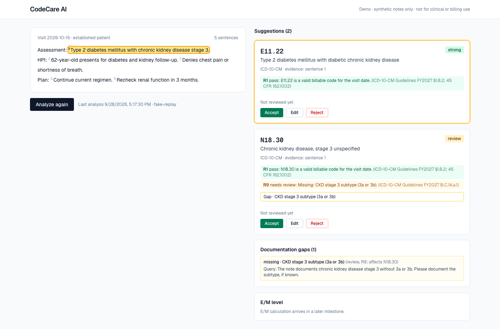

# CodeCare AI

An explainable ICD-10-CM coding assistant for outpatient notes. It reads a clinical note, suggests codes, cites the sentence behind each code, runs deterministic coding-rule checks, and raises documentation gaps. A human coder accepts, edits, or rejects every suggestion.

> **Synthetic data only.** Every note in this repo is made up. The gold set was checked by the author against the FY2027 ICD-10-CM Official Guidelines and code tables, not by a certified coder. Not for real clinical or billing use.



## How it works

The core rule: **the LLM reads, plain code checks.**

- **Segment:** the note is split into numbered sentences; every suggestion must cite sentence numbers that exist.
- **Extract (LLM):** the model lists clinical facts (condition, status such as active, denied or suspected, details such as CKD stage) with their evidence sentences.
- **Retrieve (code tables):** each fact gets candidate codes from the CMS ICD-10-CM tables for the code set valid on the visit date (trigram search on Alphabetic Index terms, full-text and vector search on descriptions, merged by rank fusion).
- **Select (LLM, candidates only):** the model picks from the candidate list. It cannot invent a code; anything outside the list or not billable is dropped by rule R1.
- **Rules R1-R12 (pure Python, one file and one test file per rule):** combination codes (diabetes + CKD, hypertension + CKD/heart failure), stage and type reconciliation, uncertain diagnoses, duplicates, long-term drug codes, Excludes1. Each result cites its guideline section.
- **Gaps and review:** missing details (CKD stage, heart-failure type or acuity) become neutral documentation queries. The coder's accept/edit/reject decisions are stored append-only.

Architecture, types, rules, and decisions: [DESIGN.md](DESIGN.md).

## Results

20 synthetic gold notes, same model (`openai/gpt-oss-120b` on Groq) for every column.

| Metric | Target | LLM-only baseline | Pipeline, M3 (no rules) | Pipeline, M4 (rules) |
|---|---|---|---|---|
| Precision | >= 0.85 | 0.56 | 0.78 | **0.95** |
| Recall | >= 0.80 | 0.49 | 0.82 | **0.95** |
| Invented code rate | 0 | 0.03 | 0.00 | **0.00** |
| Invalid code rate | 0 | 0.12 | 0.00 | **0.00** |
| Gap recall | >= 0.80 | 0.00 | 0.00 | **1.00** |

- Invented = a code not in the code set for the visit date. Invalid = invented or not billable (for example the category header `N18.3`).
- The M4 column is a replay: the saved LLM outputs of the live run `2026-09-28-n20-pipeline-extract_v1-openai_gpt-oss-120b` rerun through the final rules with no LLM calls (`2026-09-28-n20-replay-extract_v1-fix-openai_gpt-oss-120b`). The live run measured 5,369 tokens and about 9.4 s per note.
- Remaining misses: n004 (model picks E11.9 over E11.65), n014 (extra I50.9 next to I50.20), n015 (symptom code R06.02 behind a suspected diagnosis).
- Every per-note result is committed under [eval/results/](eval/results/); CI re-scores them and fails on any invented or invalid code.
- The gold set is small and synthetic, so these numbers show the method works, not production accuracy.

## Run it locally

Prerequisites: Python 3.12, [uv](https://docs.astral.sh/uv/), Node 20+, Docker.

```bash
# database (Postgres with pgvector and pg_trgm)
docker compose up -d --wait db

# backend
uv venv --python 3.12 backend/.venv && source backend/.venv/bin/activate
cd backend && uv pip install -e ".[dev]" && cp .env.example .env && alembic upgrade head && cd ..

# code tables (CMS files are downloaded to data/raw/; embeddings take ~20-30 min on CPU)
python scripts/seed_abbreviations.py
python scripts/load_icd10cm.py --fy 2027
python scripts/embed_codes.py --code-set ICD10CM-FY2027

# LLM: any OpenAI-compatible API. Set in backend/.env (free Groq key: https://console.groq.com/keys)
#   LLM_BASE_URL=https://api.groq.com/openai/v1  LLM_API_KEY=<your key>  LLM_MODEL=openai/gpt-oss-120b

# start
cd backend && uvicorn app.main:app --reload            # API on :8000
cd frontend && npm install && npm run dev              # web app on :3000
```

No API key? `cd frontend && npm run test:e2e` starts a fake LLM that replays recorded responses, the backend, and the web app, and runs the browser tests.

Tests and evaluation (backend venv active):

```bash
cd backend && pytest tests/unit && pytest tests/integration   # never call a real LLM
python eval/run_eval.py --setup pipeline --limit 10            # live smoke eval (uses tokens)
python eval/run_eval.py --replay-of <RUN_ID>                   # rerun rules on saved outputs, no tokens
python eval/rescore.py                                         # CI gate
```

## Limitations

- Small synthetic gold set (20 notes), no review by a certified coder.
- Outpatient ICD-10-CM only; CPT and E/M levels are not implemented yet.
- Groq's free tier caps `gpt-oss-120b` at 200k tokens per day, about 37 pipeline notes at the measured rate.
- Rules cover diabetes, hypertension, CKD, and heart failure; other combination codes, secondary diabetes, and "unrelated" statements without a named cause are known limits (DESIGN.md §3.4).
- `extract_v2` (symptoms behind suspected diagnoses) is built but not yet measured on the full gold set.
- No authentication, claim submission, or payer rules (out of scope).

## Deliverables

[deliverables/](deliverables/): report, slides, video, and resume ([deliverables/README.md](deliverables/README.md)).
